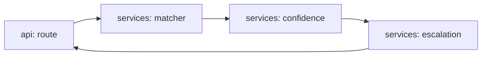

# agent-query-routing

[](https://github.com/Shamanchi/agent-query-routing/actions/workflows/ci.yml)
[](https://www.python.org/)
[](./Dockerfile)
[](./LICENSE)

> **English TL;DR:** FastAPI query router: keyword-based department classification (billing/technical/sales, EN+RU) with confidence and escalation on urgent or low-confidence queries. Fully offline, no tokens needed.

Агент маршрутизации обращений: классификация по отделам на ключевых словах (billing/technical/sales, EN+RU), уверенность и эскалация срочных или неуверенных запросов. Работает офлайн.

Источник темы: `Hands-On-AI-Engineering / P-116 (customer_query_routing_agent)` — идею и постановку взяли из каталога, код и тексты написаны с нуля.

## Какую задачу решает

Входящие обращения нужно быстро разложить по отделам: биллинг, техподдержка, продажи. Агент считает совпадения с тематическими словарями, возвращает отдел и уверенность, а срочные или непонятные запросы помечает на эскалацию человеку.

## Архитектура



Слои: `api/` → `services/` → `core/`, настройки через `pydantic-settings`.

## Быстрый старт

```bash
cp .env.example .env
pip install -r requirements.txt
uvicorn app.main:app --reload
curl -X POST http://127.0.0.1:8000/api/v1/route -H "Content-Type: application/json" -d "{\"text\": \"My invoice has a wrong charge, refund please\"}"
```

Docker:

```bash
docker compose up --build
```

## API

- `GET /api/v1/health` — проверка сервиса.
- `GET /api/v1/departments` — отделы и их ключевые слова.
- `POST /api/v1/route` — маршрутизировать запрос. Тело: `{"text": "..."}`. Ответ: `department`, `confidence`, `escalate`, `matched`.

Пример ответа `route` (сокращённо):

```json
{
  "department": "billing",
  "confidence": 0.75,
  "escalate": false,
  "matched": ["invoice", "charge", "refund"]
}
```

## Переменные окружения (.env)

| Переменная | Назначение | По умолчанию |
|---|---|---|
| `ESCALATE_BELOW` | Эскалация при уверенности ниже порога | `0.4` |
| `APP_HOST` / `APP_PORT` | Хост/порт API | `0.0.0.0` / `8000` |

Полный список — в [.env.example](./.env.example).

## Тесты

```bash
pip install -r requirements.txt
pytest -q
pytest -q -m integration
```

Unit-тесты без сети. Интеграционные (`-m integration`) — через TestClient, тоже без сети.

## Контакты

- Telegram: @PavelYrevichh
- Email: Lietman46@mail.ru
- GitHub: Shamanchi
- FL.ru: https://www.fl.ru/users/Shamanchi
